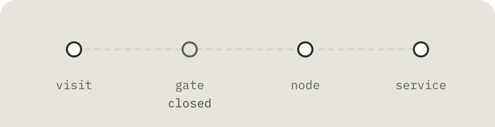
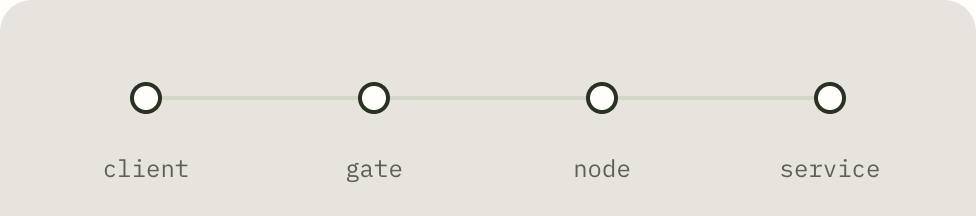
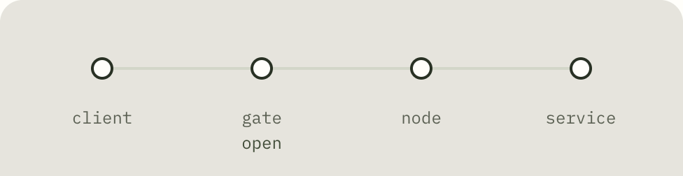

# Umbra

<p align="center">
  
</p>

<p align="center"><strong>自托管的 TCP / UDP 内网服务访问网关</strong></p>

<p align="center">
  <a href="https://github.com/chenow9/umbra/actions/workflows/ci.yml"></a>
  <a href="https://github.com/chenow9/umbra/releases/latest"></a>
  <a href="https://github.com/chenow9/umbra/releases"></a>
  <a href="https://hub.docker.com/r/chenow9/umbrad"></a>
  <a href="LICENSE"></a>
</p>

<p align="center">
  <a href="https://umbrad.grok.me">项目主页</a> ·
  <a href="#快速开始">快速开始</a> ·
  <a href="#控制台双因素认证">2FA</a> ·
  <a href="#安全模型与边界">安全边界</a> ·
  <a href="CHANGELOG.md">更新日志</a> ·
  <a href="README.en.md">English</a>
</p>

Umbra 将 NAT 或防火墙后的 TCP / UDP 服务连接到由你掌控的公网入口。服务配置、访问方式和 CIDR 规则都在公网入口集中管理并动态下发；节点只需保存入口地址、节点凭证和 CA，无需反复修改本地服务配置。

## 认识公网入口、节点和服务

本文沿用控制台中的名称。使用流程是：**部署公网入口 → 登记节点 → 添加服务 → 选择访问方式 → 连接服务**。

| 名称 | 含义 | 程序或技术名称 |
| --- | --- | --- |
| 公网入口（Gateway） | 部署在公网服务器上，提供控制台、接收节点隧道和业务连接 | `umbrad` |
| 节点（Node） | 部署在能访问目标内网服务的机器上，主动连接公网入口 | `umbra-node` |
| 服务（Service） | 节点下的一项转发配置，包含目标地址、协议、访问方式及所需的入口端口 | API 和协议中称为 Mapping（映射） |
| 访问端（Visitor client） | 凭证访问时运行在访问者电脑上的客户端，持访问凭证连接公网入口 | `umbra-visit` |

一个节点可以添加多个服务。“服务”在旧文档中称为“映射”；API 路径 `/v1/mappings`、字段 `mappingId` 和协议消息 `MappingSync` / `MappingAck` 仍保留技术名称。下文只有描述端口之间的映射关系时使用“端口映射”。

**节点凭证**用于节点连接公网入口；**访问凭证**用于访问者连接某个服务，在协议和命令中称为票据（ticket，`--ticket`）。两者用途不同。三种访问方式及其 `mode` 配置值见下表。

## 为什么选择 Umbra

- **服务端集中管理**：节点、服务、访问方式、ACL 和凭证统一在 Web 控制台管理。
- **TCP / UDP 都能转发**：工作在 L4，不绑定 HTTP，可承载 SSH、RDP、数据库、游戏和自定义协议。
- **三种访问方式**：每个服务可独立选择凭证访问、临时放行或公开访问。
- **配置动态生效**：创建、修改、启停服务无需重启入口或逐台登录节点。
- **隧道与访问可观测**：查看节点状态、服务可达性、实时速率、累计流量、丢弃计数和审计记录。
- **平滑更新**：Unix 入口可用 `SIGUSR2` 切换新进程，已建立隧道由旧进程继续服务直到结束。

Umbra 适合家庭实验室、远程开发、私有服务、游戏 UDP 和临时第三方访问。它不提供 HTTP 路由、WAF 或全球边缘网络；如果需要 L7 能力，应与 nginx、Caddy 等专用工具配合。

<a id="选择访问模式"></a>

## 选择访问方式

添加服务时，在“谁可以访问”步骤选择访问方式。下表的名称与中英文页面一致，顺序也与页面一致；`mode` 列用于对照 API 和配置文件。

| 页面名称 | `mode` 值 | 公网暴露 | 访问方式 | 适合场景 |
| --- | --- | --- | --- | --- |
| 凭证访问（Ticket access） | `visitor` | 服务不在入口监听公网业务端口 | 签发访问凭证（默认 24 小时），访问者运行 `umbra-visit` 在本机开端口 | 不希望暴露公网业务端口的私有服务 |
| 临时放行（Temporary allow） | `spa` | 入口监听服务端口；Linux nftables 模式下，未授权流量在内核丢弃 | 先为来源 IP 临时放行，再使用原有客户端连接；默认 60 秒，只影响新连接 | 希望减少扫描暴露的 SSH、RDP 等管理服务 |
| 公开访问（Public access） | `public` | 入口监听服务端口，可被扫描发现 | 原有客户端直接连接，可选 CIDR 白名单 | 公开服务、游戏 UDP，或业务自身已有强认证 |

> 控制台新建服务默认使用**凭证访问**，不开放公网业务端口。为兼容已有 API 客户端，创建 API 省略 `mode` 时仍使用 `public`（公开访问）。

### 访问流程动图

以下动图录自[官网的访问方式演示](https://umbrad.grok.me/#modes)，展示流程，不代表实际耗时。图中 `gate` 是公网入口，`node` 是内网节点，`service` 是目标服务。

**凭证访问（Ticket access，`visitor`）**

访问者运行 `umbra-visit`（图中的 `visit`），通过带访问凭证的隧道连接服务。`closed` 表示没有开放公网业务端口，入口仍接收隧道连接。



**临时放行（Temporary allow，`spa`）**

未授权的来源流量被丢弃（`drop`）；发起临时放行请求（`knock`）后，获准的来源 IP 可在授权窗口内使用原有客户端连接服务。



**公开访问（Public access，`public`）**

公网入口开放业务端口（`open`），访问者使用原有客户端（`client`）直接连接，再由入口经节点转发到目标服务。



## 工作原理

```text
公开访问 / 临时放行客户端 ── 业务端口──┐
凭证访问（umbra-visit）── 票据隧道─────├──▶ 公网入口（umbrad）══ TLS / Yamux ══ 节点（umbra-node）──▶ 内网服务
控制台 / API ── 服务配置与访问策略─────┘
```

节点主动建立到 `umbrad` 的长期 TLS 1.3 连接，Yamux 在其中复用控制 Stream 和多条 TCP 业务 Stream。公网入口是配置的唯一权威源：在线时通过控制 Stream 推送 `MappingSync`，节点用 `MappingAck` 确认；离线修改会在节点重连后用完整快照对齐。

UDP 在可用时优先使用独立数据面，不可用时可按配置回退到 Yamux。控制台中的服务配置确认表示配置已送达；“探测”会实际经过公网入口 → 节点 → 目标服务的链路，用于验证目标可达性。

## 组成

| 程序          | 作用                                                                                |
| ------------- | ----------------------------------------------------------------------------------- |
| `umbrad`      | 公网入口：提供 TLS 1.3 隧道、服务端口监听、临时放行的内核丢弃、热升级、Web 控制台和 API |
| `umbra-node`  | NAT 后节点：主动连接入口，按下发的服务配置连接本地目标                                  |
| `umbra-visit` | 访问端：持票据建立隧道，在访问方本机开启 TCP / UDP 端口                             |
| Web 控制台    | 管理节点、服务、凭证、流量、审计和部署命令                                          |

## 快速开始

推荐在 Linux 公网主机上使用 Docker Compose 部署入口。宿主机需允许节点访问 `4400/TCP`；使用独立 UDP 数据面时还应允许 `4400/UDP`。业务端口按需开放。

**1. 启动公网入口**

```bash
git clone https://github.com/chenow9/umbra.git
cd umbra

# 先将 deploy/compose.gate.yml 中的 gate.example.com:4400
# 改成 Node 真正能访问的域名或公网 IP
UMBRA_TAG=0.3.0 docker compose -f deploy/compose.gate.yml up -d
docker logs -f umbrad
```

入口容器使用 host 网络，并将证书、凭证、服务配置和流量数据保存到 `umbra-tls` volume。生产环境请固定版本，不要直接跟随 `latest`。

**2. 打开控制台**

管理口默认仅监听 `127.0.0.1:8080`。可以在本机建立 SSH 转发：

```bash
ssh -L 8080:127.0.0.1:8080 user@gate.example.com
```

然后打开 `http://127.0.0.1:8080`。首次访问会依次设定管理员口令、绑定 Authenticator，并展示只出现一次的恢复码；保存恢复码后才算完成初始化。

如果要通过域名访问，请使用 HTTPS 反向代理，或为 `umbrad` 配置管理口 TLS；不要把明文管理口暴露到公网。2FA 的升级迁移、恢复和配置方法见[控制台双因素认证](#控制台双因素认证)。

控制台经反向代理访问时，还需要正确传递和信任客户端地址，否则 临时放行操作可能放行代理地址而不是实际客户端。详见[反向代理与客户端 IP](#反向代理与客户端-ip)。

不要把 `UMBRA_LOGIN=off`、`GROK_AGENT` 或 `GROK_PROJECT_ID` 用在生产入口上，它们会跳过整个控制台认证。

**3. 登记节点**

在控制台选择「节点 → 登记节点」，选择目标平台后执行生成的安装命令。`umbra_boot_…` 凭证只显示一次，生成的命令已包含入口 CA 和系统服务配置。

**4. 添加并连接服务**

控制台首页是「节点」。打开已登记的节点，点击「添加服务」，依次完成「服务在哪里」「谁可以访问」「确认并接入」。在节点内添加服务会自动选中当前节点；填写该节点能访问的目标地址与端口，再选择凭证访问、临时放行或公开访问。「全部服务」和快捷搜索用于跨节点查找。限速和超时在高级设置中。保存后直接进入「连接」面板：

- “配置就绪”表示节点已确认最新配置，不代表目标服务或外网路径已验证。
- “探测”会经过公网入口 → 节点 → 目标服务发起一次真实请求，用于辅助判断链路是否可达。
- **凭证访问**：签发访问命令，在访问者电脑上运行 `umbra-visit`，再连接本机访问口。
- **临时放行**：点击「临时放行我的 IP」，在有效期内使用原有客户端连接入口业务端口。
- **公开访问**：使用原有客户端直接连接入口业务端口。

> 探测会向真实目标发送少量探测数据，它验证的是链路与响应，不等同于应用层健康检查。

**5. 在多台公网入口间复制节点和服务**

上游把同一业务域名指到多台独立 `umbrad` 时，可在已配置好的入口导出节点和服务，再导入到其他入口，避免逐个补端口映射。控制台「节点」和节点详情提供导出 / 导入。

- 导出 JSON 带 `schemaVersion`。节点只包含名称、备注等可复用字段；服务包含协议、公网端口、内网地址、访问方式、启停、白名单、限速、连接数和超时。
- **不会**导出节点认证凭证、证书私钥、管理端认证信息、访问凭证或运行状态。来源标识用于重复导入识别，不会把源入口的数据库 ID 当成目标入口的实体 ID。
- 导入先解析预览再写入。每个来源节点可「新建」（走现有登记流程，签发独立身份和只显示一次的凭证）或绑定目标入口已有节点。已匹配服务默认跳过，更新需查看差异后选择。不会自动接管无关服务，也不会删除配置里没有的本地服务。
- 端口冲突按当前公网入口的实际监听规则检查（含批次内部冲突），不只按节点检查。
- 配置保存成功后仍走现有下发、版本和 ACK。节点离线或尚未确认会显示为等待下发，不代表导入失败。导入的停用服务保持停用。
- 复制配置**不会**自动建立内网隧道。新节点仍须在内网部署，并连接到**当前这台**公网入口。

### 反向代理与客户端 IP

`UMBRA_HTTP_TRUST_PROXY`（或 `-http-trust-proxy`）指定哪些**直接连接 umbrad 的反向代理**可以提供真实客户端地址。这里填的是反向代理的 IP 或 CIDR，不是访问者的公网 IP，也不是服务的访问白名单。

处理规则如下：

- 如果 HTTP 请求的直接来源不在信任列表中，`umbrad` 忽略转发头，使用 TCP 连接的来源地址。因此不经反向代理直接访问控制台时，保持该配置为空即可。
- 如果直接来源属于信任的代理 CIDR，`umbrad` 依次使用 `X-Forwarded-For` 的第一个地址、`X-Real-IP`，最后才回退到 TCP 连接来源。
- 该结果用于控制台登录、审计和 临时放行操作的来源 IP 识别。公开访问 / 临时放行 的业务端口仍由客户端直接连接，不需要经过 HTTP 反向代理。

例如，同机 Nginx 通过回环地址访问 `umbrad`：

```yaml
services:
  umbrad:
    environment:
      # 填写直接连接 umbrad 的代理地址，不是客户端公网 IP。
      UMBRA_HTTP_TRUST_PROXY: 127.0.0.0/8
    command:
      - -http
      - 127.0.0.1:8080
```

当 Nginx 是最外层代理时，应覆盖客户端传入的 `X-Forwarded-For`，而不是盲目保留或追加：

```nginx
location / {
    proxy_pass http://127.0.0.1:8080;
    proxy_set_header Host $host;
    proxy_set_header X-Forwarded-For $remote_addr;
    proxy_set_header X-Real-IP $remote_addr;
    proxy_set_header X-Forwarded-Proto $scheme;
}
```

如果代理位于 Docker 网桥或另一台主机，请改为它实际连接 `umbrad` 时的地址；能使用精确的 `/32` 或 `/128` 时，不要信任整个宽泛网段。多层代理中，最外层可信入口必须清理客户端伪造的转发头，后续代理再正确传递它。不要配置 `0.0.0.0/0` 或 `::/0`，否则任意直连客户端都可能伪造来源地址。

修改 Compose 中的环境变量后，需要执行 `docker compose up -d umbrad` 使 Compose 重建服务；仅执行 `docker restart` 不会把新环境变量写入现有容器。生效后可在审计页检查 `mapping.knock` 记录：其 IP 应与发起业务连接的客户端出口 IP 一致，而不是 `127.0.0.1` 或 Docker 网桥地址。

## 控制台双因素认证

从 `v0.1.5` 起，控制台默认启用 TOTP 2FA。支持 1Password、Google Authenticator、Microsoft Authenticator 等能够生成六位 TOTP 验证码的应用。服务器和手机时间必须保持同步。

| 场景 | 需要的凭证 | 处理方式 |
| ---- | ---------- | -------- |
| 首次安装 | 新管理员口令 | 扫描二维码、提交六位验证码并保存 10 个一次性恢复码 |
| 日常登录 | 口令 + TOTP | 也可以使用口令 + 一个未使用的恢复码 |
| 旧版本升级 | 原口令 + 本机迁移码 | 旧会话会失效；读取 `2fa-bootstrap` 后重新绑定 Authenticator |
| 丢失手机 | 口令 + 恢复码 | 登录后在「部署 → 控制台认证」更换绑定并生成新恢复码 |
| 手机和恢复码都丢失 | 服务器本机权限 + 原口令 | 停止守护进程，执行离线 `-reset-2fa`，再用迁移码绑定 |

从不支持 2FA 的版本升级后，在入口服务器读取一次性迁移码：

```bash
# Docker Compose
docker exec umbrad cat /var/lib/umbra/2fa-bootstrap

# 二进制部署
sudo cat /var/lib/umbra/2fa-bootstrap
```

迁移码不会写入日志，绑定成功后文件会被删除。不要把迁移码、TOTP 密钥、二维码或恢复码发送到聊天、工单或日志中。

手机和恢复码都丢失时，先停止正在运行的入口，再离线重置：

```bash
# 二进制/系统服务部署
sudo systemctl stop umbrad
sudo umbrad -reset-2fa -tls-dir /var/lib/umbra
sudo systemctl start umbrad

# Docker Compose 部署
docker compose -f deploy/compose.gate.yml stop umbrad
docker compose -f deploy/compose.gate.yml run --rm umbrad \
  -reset-2fa -tls-dir /var/lib/umbra
docker compose -f deploy/compose.gate.yml up -d umbrad
```

重置保留管理员口令，但会删除原 TOTP 绑定和恢复码、撤销全部管理会话，并生成新的 `2fa-bootstrap`。入口启动后使用原口令和新迁移码重新绑定。

`UMBRA_2FA` 在进程启动时读取：

| 值 | 行为 |
| -- | ---- |
| 未设置或 `on` | 默认行为；要求口令 + TOTP/恢复码 |
| `off` | 只要求口令，但保留已有 TOTP 绑定；重新开启后，关闭期间签发的会话立即失效 |
| 其他值 | 拒绝启动，避免拼写错误导致意外降级 |

关闭 2FA 时不能远程更换绑定或重新生成恢复码。若已有绑定，修改管理员口令仍要求当前第二因素。生产环境不建议关闭 2FA。

更完整的运维和故障恢复说明见 [docs/2fa.md](docs/2fa.md)。

### 二进制部署

也可以从 [Releases](https://github.com/chenow9/umbra/releases/latest) 下载对应平台的二进制。如需从源码构建：

```bash
# go.mod：Go 1.25（toolchain 1.25.14）
./scripts/build-binaries.sh
# dist/：Linux / macOS / Windows × amd64 / arm64
```

手动启动入口：

```bash
sudo ./dist/umbrad_linux_amd64 \
  -listen :4400 \
  -advertise gate.example.com:4400 \
  -http 127.0.0.1:8080 \
  -bind 0.0.0.0 \
  -tls-dir /var/lib/umbra
```

`-advertise` 是节点和访问端实际连接的对外地址，只用于生成部署命令，不改变监听地址。`-tls-dir` 中包含：

- `ca.crt` / `gate.crt` / `gate.key`：入口 CA 与证书
- `control.json`：管理员口令、TOTP 绑定、登录会话、节点凭证、服务配置与累计流量
- `2fa-bootstrap`：旧版本升级或本机重置 2FA 后的一次性迁移码，绑定成功后删除
- `traffic`：速率曲线采样（约每 10 秒写一次）
- `state.json`：热升级时的恢复状态

手动启动节点：

```bash
./umbra-node \
  --server gate.example.com:4400 \
  --tls-ca /etc/umbra/ca.crt \
  --token umbra_boot_…
```

节点凭证默认 90 天，也可设为永不过期；过期前轮换，或随时吊销。轮换后旧凭证大约 90 秒内仍可用。

<details>
<summary><strong>展开查看节点系统服务管理命令</strong></summary>

控制台生成的二进制安装命令会把 `umbra-node` 注册为系统服务。命令执行完成后可以关闭终端；节点会继续运行，并随系统启动自动上线。

**Linux（systemd）**

```bash
# 查看状态和最近日志
sudo systemctl status umbra-node
sudo journalctl -u umbra-node -n 100 --no-pager

# 临时停止；下次开机仍会自动启动
sudo systemctl stop umbra-node

# 启动或重启
sudo systemctl start umbra-node
sudo systemctl restart umbra-node

# 停止并禁用开机启动
sudo systemctl disable --now umbra-node

# 恢复开机启动并立即运行
sudo systemctl enable --now umbra-node
```

彻底卸载 Linux 服务：

```bash
sudo systemctl disable --now umbra-node
sudo rm -f /etc/systemd/system/umbra-node.service
sudo systemctl daemon-reload
sudo rm -f /usr/local/bin/umbra-node
```

**macOS（launchd）**

```bash
# 查看状态
sudo launchctl print system/io.umbra.node

# 临时停止；下次开机仍会自动启动
sudo launchctl bootout system/io.umbra.node

# 再次启动
sudo launchctl bootstrap system /Library/LaunchDaemons/io.umbra.node.plist

# 重启
sudo launchctl kickstart -k system/io.umbra.node

# 停止并禁用开机启动
sudo launchctl bootout system/io.umbra.node 2>/dev/null || true
sudo launchctl disable system/io.umbra.node

# 恢复开机启动并立即运行
sudo launchctl enable system/io.umbra.node
sudo launchctl bootstrap system /Library/LaunchDaemons/io.umbra.node.plist
```

彻底卸载 macOS 服务：

```bash
sudo launchctl bootout system/io.umbra.node 2>/dev/null || true
sudo launchctl disable system/io.umbra.node
sudo rm -f /Library/LaunchDaemons/io.umbra.node.plist
sudo rm -f /usr/local/libexec/umbra-node-run
sudo rm -f /usr/local/bin/umbra-node
```

**Windows（管理员 PowerShell）**

```powershell
# 查看状态
Get-Service -Name UmbraNode

# 临时停止；下次开机仍会自动启动
Stop-Service -Name UmbraNode

# 启动或重启
Start-Service -Name UmbraNode
Restart-Service -Name UmbraNode

# 停止并禁用开机启动
Stop-Service -Name UmbraNode -ErrorAction SilentlyContinue
Set-Service -Name UmbraNode -StartupType Disabled

# 恢复开机启动并立即运行
Set-Service -Name UmbraNode -StartupType Automatic
Start-Service -Name UmbraNode
```

彻底卸载 Windows 服务：

```powershell
Stop-Service -Name UmbraNode -ErrorAction SilentlyContinue
sc.exe delete UmbraNode
```

卸载系统服务默认保留 CA 和本地配置，方便重新安装。确认不再使用该节点时，先在控制台吊销节点凭证，再按需删除 `/etc/umbra`、`/usr/local/etc/umbra` 或 `C:\ProgramData\Umbra`；删除本地文件不会自动删除控制台中的节点记录。

</details>

<a id="visitor-访问端"></a>

### 凭证访问客户端（umbra-visit）

在需要访问内网服务的电脑上安装对应平台的 `umbra-visit`。在节点的服务列表或「全部服务」中打开凭证访问服务的「连接」面板，选择「签发 24 小时访问命令」，然后执行只显示一次的命令：

```bash
umbra-visit --server gate.example.com:4400 \
  --tls-ca /etc/umbra/ca.crt \
  --ticket umbra_vis_… \
  --local 127.0.0.1:2222
```

随后业务客户端连接 `127.0.0.1:2222`。`umbra-visit` 是访问侧按需运行的进程，不要装在入口或内网节点上；停止进程即关闭这个本机访问口。客户端安装说明见服务的「连接」面板，下载与构建方法见下文。入口镜像 `chenow9/umbrad` 里已带 `umbra-visit`。

## Docker（公网入口 + 内网节点）

入口容器同时承载控制面和数据转发：`-http` 提供网页与 API（默认 `127.0.0.1:8080`），节点通过 `:4400` TLS 连接。控制台已内置在 `umbrad` 镜像中，生产环境无需另行运行前端开发服务器。

Docker Hub 提供 **linux/amd64** 和 **linux/arm64** 镜像：

- `chenow9/umbrad`（含 `umbrad` 与 `umbra-visit`）
- `chenow9/umbra-node`

生产环境建议固定使用当前正式版本 `0.3.0`，避免 `latest` 更新后意外改变运行版本。

**入口**（Linux 宿主机，host 网络）：

```bash
UMBRA_TAG=0.3.0 docker compose -f deploy/compose.gate.yml up -d
# 浏览器打开入口的控制台（默认只绑 127.0.0.1:8080）
# named volume umbra-tls → /var/lib/umbra
# 里面是证书、control.json、traffic。不要只挂 ca.crt。
```

`deploy/compose.gate.yml` 里已带 `-advertise gate.example.com:4400`，部署时改成节点真正能连上的地址。

**节点**（同样 host 网络，才能把服务目标写成宿主机 `127.0.0.1`）：

控制台登记弹窗的 Docker 命令会把 CA 写进本机再 `docker run --network host`。也可以用 compose：

```bash
cp deploy/node.env.example node.env   # 填 UMBRA_SERVER / UMBRA_TOKEN
# 把入口的 ca.crt 放到当前目录
UMBRA_TAG=0.3.0 docker compose -f deploy/compose.node.yml up -d
```

换入口程序本身不停机：

```bash
kill -USR2 $(pidof umbrad)   # 或 systemctl reload umbrad
```

已有隧道留在旧进程直到结束；新连接由新进程接管。

## 网络与端口

| 用途                      | 默认地址         | 是否需要公网开放                                        |
| ------------------------- | ---------------- | ------------------------------------------------------- |
| 节点 / 访问端控制与隧道 | `4400/TCP`       | 是，仅需对需要连接的来源开放                            |
| UDP 独立数据面            | `4400/UDP`       | `-udp auto/required` 使用；不可用时 `auto` 可回退 Yamux |
| Web 控制台与 API          | `127.0.0.1:8080` | 否；建议保持回环监听，通过 SSH 或 HTTPS 反代访问        |
| 公开访问 / 临时放行服务     | 用户指定         | 是，按服务需求开放 TCP 或 UDP                           |
| 凭证访问服务            | 无公网业务端口   | 否                                                      |

## 平台

|                            | amd64 | arm64 |
| -------------------------- | ----- | ----- |
| Linux                      | ✓     | ✓     |
| macOS                      | ✓     | ✓     |
| Windows                    | ✓     | ✓     |
| Docker（linux，host 网络） | ✓     | ✓     |

临时放行的内核丢弃仅支持 Linux。macOS / Windows 入口仍是用户态断开。Docker 入口需要 Linux 宿主机的 host 网络。

## 仓库结构

```
cmd/umbrad          入口
cmd/umbra-node      节点
cmd/umbra-visit     访问端（本机 L4）
internal/           控制通道、策略、nftables、TLS、热升级、控制面 HTTP
src/                管理面（React；生产由 umbrad -http / -ui 提供）
scripts/            交叉编译与冒烟
deploy/             入口 / 节点 Docker Compose
.github/workflows   CI：vet / test / race / govulncheck；tag 才推镜像，且必须先过 CI
```

常用入口参数（`umbrad -h`）：

| 参数         | 默认              | 作用                                      |
| ------------ | ----------------- | ----------------------------------------- |
| `-listen`    | `:4400`           | 节点控制通道                              |
| `-advertise` | 空（沿用 listen） | 写进部署/访客命令的对外地址               |
| `-http`      | `127.0.0.1:8080`  | 控制台与 API                              |
| `-bind`      | `127.0.0.1`       | 业务口监听地址；公网入口用 `0.0.0.0`      |
| `-tls-dir`   | `/var/lib/umbra`  | 证书、状态、`control.json`、`traffic`     |
| `-reset-2fa` | 关                | 离线重置控制台 2FA（须先停止守护进程）    |
| `-stealth`   | `auto`            | `nft` / `off` / `auto`                    |
| `-udp`       | `auto`            | UDP 数据面：`auto` / `required` / `yamux` |

节点：`--server`、`--token`、`--tls-ca`。访问端另加 `--ticket`、`--local`。

### 入口认证、容量与 UDP 准入环境变量

这些变量由 `umbrad` 在启动时读取，修改后需要重启或重建入口容器。它们是入口级默认策略；服务自身的 `maxConns` 仍会独立生效。

| 环境变量                      | 默认值 | 含义                                                                                                                                                                                         |
| ----------------------------- | -----: | -------------------------------------------------------------------------------------------------------------------------------------------------------------------------------------------- |
| `UMBRA_2FA`                   |   `on` | 控制台是否强制 TOTP。未设置或 `on` 为开启，`off` 为关闭；其他值拒绝启动。关闭时不删除已有绑定。`UMBRA_LOGIN=off` / `GROK_AGENT` / `GROK_PROJECT_ID` 会跳过整个登录（含 2FA），仅用于预览。   |
| `UMBRA_MAX_SPLICES`           | `8192` | 整个入口允许同时存在的 TCP 转发连接（splice）总数，所有 TCP 服务和凭证访问转发共享。实际可用并发还受各服务 `maxConns` 限制；只接受大于 `0` 的整数。达到上限后拒绝新的 TCP 转发，不中断已有连接。 |
| `UMBRA_UDP_MAX_FLOWS_PER_IP`  |  `256` | 每个服务内，同一来源 IPv4（IPv6 按 `/64` 聚合）允许同时存在的 UDP flow 数。UDP flow 由来源地址和端口标识，并保持到 UDP 空闲超时；`0` 表示关闭此限制。                                        |
| `UMBRA_UDP_NEW_FLOWS_PER_SEC` |  `256` | 每个服务内，每个来源 IPv4（IPv6 按 `/64` 聚合）每秒允许新建的 UDP flow 数，采用令牌桶限制突发建流；`0` 表示关闭此限制。它不限制已有 flow 的 UDP 包速率（pps）。                              |
| `UMBRA_UDP_NEW_FLOWS_PER_MAP` | `1024` | 单个服务每秒允许新建的 UDP flow 总数，所有来源地址合计，采用令牌桶限制突发建流；`0` 表示关闭此限制。它不限制已有 flow 的 UDP 包速率（pps）。                                                 |

UDP 的活动 flow 总数仍受服务 `maxConns` 限制。新 flow 必须同时满足 `maxConns`、单来源活动 flow 上限、单来源建流速率和单服务建流速率；任何一项达到上限都会拒绝该新 flow，已有 flow 不受影响。

Docker Compose 可通过 shell 或 Compose 的 `.env` 文件覆盖默认值，例如：

```bash
UMBRA_MAX_SPLICES=16384 \
UMBRA_UDP_MAX_FLOWS_PER_IP=512 \
docker compose -f deploy/compose.gate.yml up -d
```

提高 TCP 上限前，应同时检查入口和节点的文件描述符上限及可用内存。关闭 UDP 准入保护会增加来源地址耗尽 flow 配额或触发资源消耗型攻击的风险。

### UDP socket 接收缓冲环境变量

`umbrad`、`umbra-node` 和 UDP 访问端都会在启动或创建 UDP flow 时读取以下变量：

| 环境变量                |   默认值 | 含义                                                                                                                                                                                                                                                                                                                                                                       |
| ----------------------- | -------: | -------------------------------------------------------------------------------------------------------------------------------------------------------------------------------------------------------------------------------------------------------------------------------------------------------------------------------------------------------------------------- |
| `UMBRA_UDP_READ_BUFFER` | `524288` | 每个 UDP socket 请求的接收缓冲区字节数，覆盖公网入口的共享 uplane socket、服务监听 socket、节点 / 访问端的 uplane socket 及其本地目标 socket。只接受大于 `0` 的整数；未设置或无效时使用 512 KiB。Linux 实际值受宿主机 `net.core.rmem_max` 限制，修改后需要重启相应进程或重建容器。512 KiB 是兼顾 2C2G 小型服务器和大量 UDP flow 的保守默认值；高突发场景应在压测后显式调大。 |

在 Linux 上提高该值前，需先把宿主机的 `net.core.rmem_max` 调整到不低于请求值，例如：

```bash
sysctl -w net.core.rmem_max=16777216
UMBRA_UDP_READ_BUFFER=8388608 docker compose -f deploy/compose.gate.yml up -d
```

较大的缓冲区可以吸收突发流量和调度停顿，但不能替代足够的持续处理能力。可通过 `ss -u -m` 查看 socket 的实际 `rb`，并通过 `Udp:RcvbufErrors` 判断是否仍发生接收队列溢出。

### UDP 丢包诊断

入口公开的 `/health` 仅返回整体健康状态；登录后的 `/v1/health` 和服务 API（`/v1/mappings`） 提供从业务端口、uplane 到客户端回写的分段累计计数。节点可设置 `UMBRA_UDP_STATS_INTERVAL` 输出对应的 JSON 统计日志：默认 `0`（关闭），设置为大于 `0` 的整数时表示输出间隔秒数，压测时建议 `10`。修改后需重启节点；统计日志不包含凭证、cookie 或密钥。

## 安全模型与边界

- 公网入口 ↔ 节点的控制与隧道连接默认使用 TLS 1.3，节点需配置可信 CA。公开访问 / 临时放行 客户端到入口的业务协议是否加密，仍由 SSH、HTTPS 或其它业务协议决定。
- 临时放行（`spa`）是认证后的来源 IP 授权，不是设备或用户身份认证。共用同一公网 NAT IP 的其它设备在放行窗口内也可能建立新连接。
- 临时放行窗口过期只阻止新连接，不中断已经建立的 TCP 连接或未过期 UDP flow。它不替代 SSH、TLS 或应用自身的认证。
- 临时放行的内核丢弃需要 Linux、nftables 和 `CAP_NET_ADMIN`，当前针对 IPv4。不满足条件时会回退为用户态拒绝，端口可能仍被扫描识别；即使使用内核丢弃，也不应理解为“绝对不可发现”。
- 访问凭证（票据）是持有者凭证：任何持有有效票据的人都能在过期或吊销前使用它，请安全传输与保管。
- 管理面默认绑定 `127.0.0.1`；绑定非回环地址时，`umbrad` 要求配置 TLS。使用反向代理时，只信任实际由你控制的代理地址，并按[反向代理与客户端 IP](#反向代理与客户端-ip)配置 `-http-trust-proxy`。
- 保护并备份整个 `-tls-dir`：其中包含 CA 私钥、入口证书、管理员口令哈希、TOTP 密钥、节点凭证、服务配置和流量历史。泄露备份等同于泄露 TOTP 密钥，并允许离线猜测管理员口令；不要将该目录上传到仓库或传给不可信第三方。
- TOTP 能显著降低口令泄露、撞库和普通暴力破解风险，但不能抵御实时钓鱼代理；输入验证码前仍需确认控制台域名和 TLS。
- 控制台新建服务默认为凭证访问（`visitor`）；API 省略 `mode` 时仍默认为公开访问（`public`）。公网上线前，请确认访问方式、CIDR 规则、目标地址和业务自身的认证配置。

## 项目与发布

- [项目主页](https://umbrad.grok.me)
- [GitHub Releases](https://github.com/chenow9/umbra/releases/latest)
- [更新日志](CHANGELOG.md)
- [问题反馈](https://github.com/chenow9/umbra/issues)
- Docker Hub：[`chenow9/umbrad`](https://hub.docker.com/r/chenow9/umbrad) · [`chenow9/umbra-node`](https://hub.docker.com/r/chenow9/umbra-node)

## 相关项目

- [MoonProxy](https://github.com/MoonProxyHQ/moonproxy-desktop) — 面向非技术用户的跨平台 frp 桌面图形客户端，支持可视化配置和连接管理，配合 frps 服务端使用。
- [Lantunnel](https://github.com/lantunnel/lantunnel) — 使用 Rust 编写的 P2P 优先、端到端加密私有组网工具；优先直连，无法直连时回退到加密中继，无需端口转发。

## 许可

Apache License 2.0。见 [LICENSE](LICENSE)。
