# Umbra 管理控制台 UI/UX 审计报告

- 审计时间：2026-08-28～2026-08-29
- 测试地址：`http://127.0.0.1:8080/`
- 测试视口：桌面 1280×720、移动端 390×844
- 审计方式：浏览器模拟真实用户操作、DOM/语义检查、响应式检查、截图复核
- 结论：**整体可用，信息架构清楚，移动端适配良好；主要短板集中在无障碍语义、弱文字对比度、长表单提交可见性和高密度状态信息。**

## 1. 审计范围与用户目标

目标用户是负责入口、节点、映射与运行状态的管理员。主要目标是：快速判断系统是否健康，登记节点，创建并下发映射，查看流量和审计记录，以及复制部署命令。

本次覆盖总览、节点、映射、流量、审计、部署、主题选择、搜索、分页、弹窗、复制反馈、键盘关闭与移动端重排。没有执行会改变配置的“签发凭证”或“保存并下发”。

## 2. 综合评分

| 维度 | 评分 | 结论 |
|---|---:|---|
| 信息架构 | 8.5/10 | 六个一级入口稳定、命名直接，桌面导航附有解释 |
| 核心任务清晰度 | 8/10 | 主动作明确，重要后果在执行前说明 |
| 视觉层级与扫读 | 7/10 | 整体克制，但映射与流量信息过密、弱文字偏淡 |
| 交互反馈与容错 | 7.5/10 | 禁用态、实时状态、复制提示、Esc 关闭表现良好 |
| 移动端体验 | 8/10 | 表格转卡片，无横向溢出；筛选器占用首屏过多 |
| 可访问性 | 5.5/10 | 标题和表格结构较好，但表单命名、状态语义和对比度存在明显风险 |
| **综合** | **7.4/10** | **已经具备可用产品骨架，建议先完成一轮 P1 可访问性与表单体验修正** |

## 3. 已确认的优点

1. 导航结构稳定，页面标题、说明和主动作位置一致，学习成本低。
2. 总览直接把“25 台节点离线，映射无法开流”与“去节点”动作放在一起，故障原因和下一步都清楚。
3. 节点与映射表单明确说明“只生成凭证”“保存后立刻下发”等后果，降低误操作风险。
4. 必填信息未完成时提交按钮保持禁用；节点与映射抽屉均可用 Esc 关闭。
5. 搜索结果即时更新，分页状态清楚；部署命令复制后出现“已复制”反馈。
6. 移动端把宽表格改造成卡片，没有简单压缩桌面表格或产生横向滚动。
7. 页面使用真实的标题、导航、表格和对话框语义；交互过程中未发现浏览器控制台错误。

## 4. 流程步骤与健康度

### Step 1：总览 — 良好

核心数字、当前故障、流量空状态、节点和最近操作都能在一页完成判断。故障提示带有直接的修复入口。

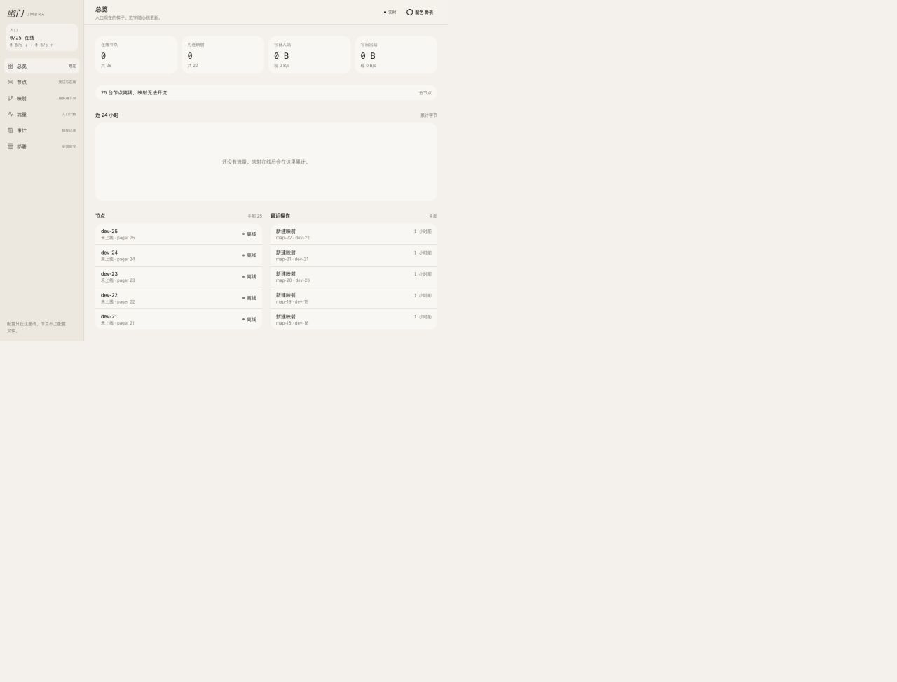

### Step 2：节点列表、搜索与分页 — 良好，存在可访问性风险

列结构完整，名称、系统、状态、映射数和凭证有效期都可快速查看。搜索 `dev-1` 后结果即时缩小，分页状态同步更新。每行的“更多操作”名称完全相同，对读屏用户缺少节点上下文。

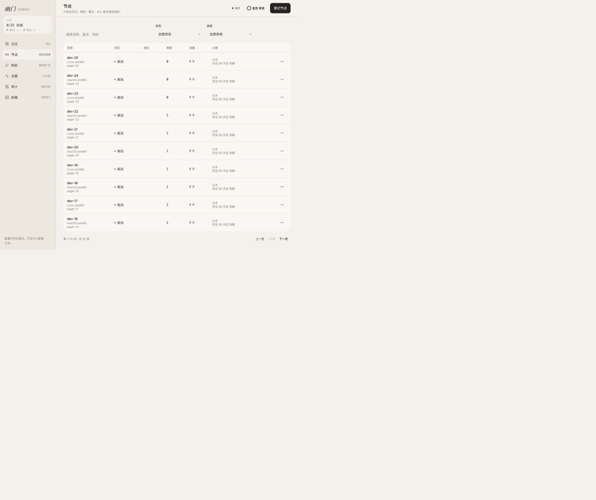

### Step 3：登记节点 — 良好，需补齐表单语义

侧边抽屉聚焦名称输入框，信息量适中，提交前后果清楚，Esc 可关闭。系统和架构下拉框在可访问性树中没有名称，视觉标签没有被程序化关联。

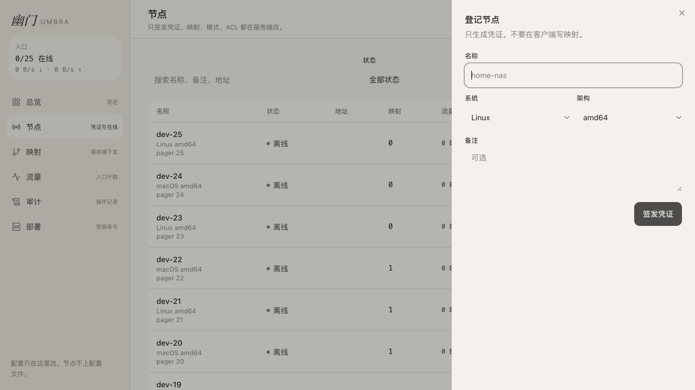

### Step 4：映射列表 — 需改进

入口、目标、节点、协议和连接限制信息完整，但离线原因、配额和协议说明在同一行重复出现，扫读成本较高。

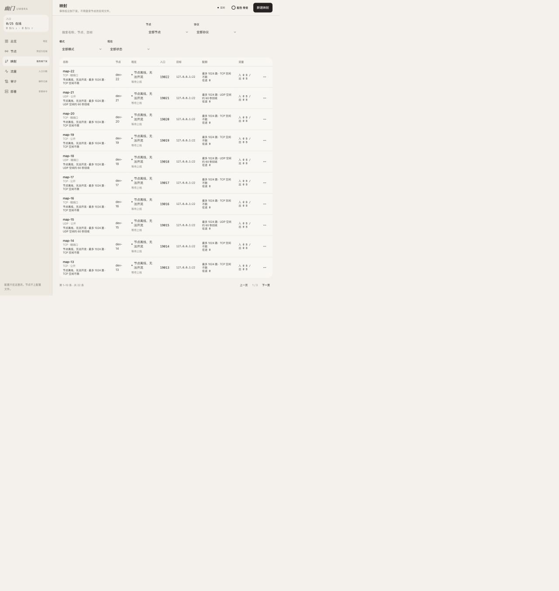

### Step 5：新建映射 — 需改进

默认值合理，并解释 TCP/UDP 空闲回收规则。桌面 720px 高视口中，抽屉 `scrollHeight=757px`、可视高度 `720px`，提交按钮底部到 `732.75px`，首次打开时被部分裁切，必须滚动才能完整看到主动作。节点、协议和模式下拉框同样缺少可访问名称。

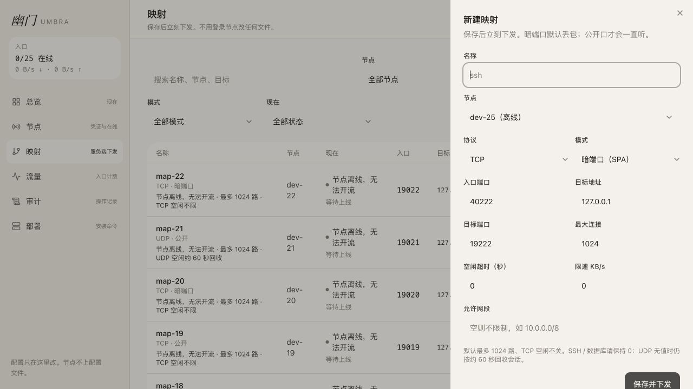

### Step 6：流量与空状态 — 基本良好

累计值、速率、图表和明细层次清楚，时间范围切换能工作。空状态只解释“映射在线后会累计”，没有直接前往映射或节点故障页的动作。时间范围当前选项仅有视觉样式，没有向辅助技术暴露 `pressed/selected` 状态。

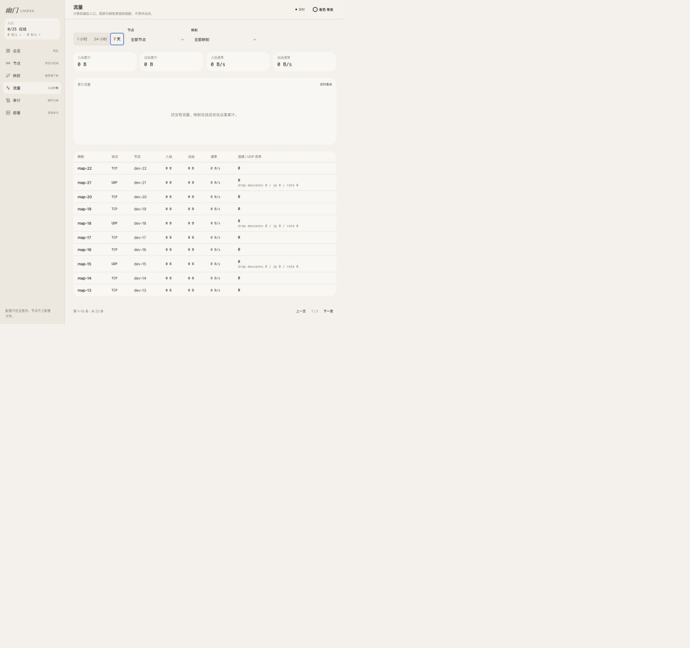

### Step 7：审计记录 — 良好

表格结构、相对时间和绝对时间同时展示，便于快速判断和精确追溯。当前测试数据较同质，尚未验证详情较长或操作类型复杂时的表现。

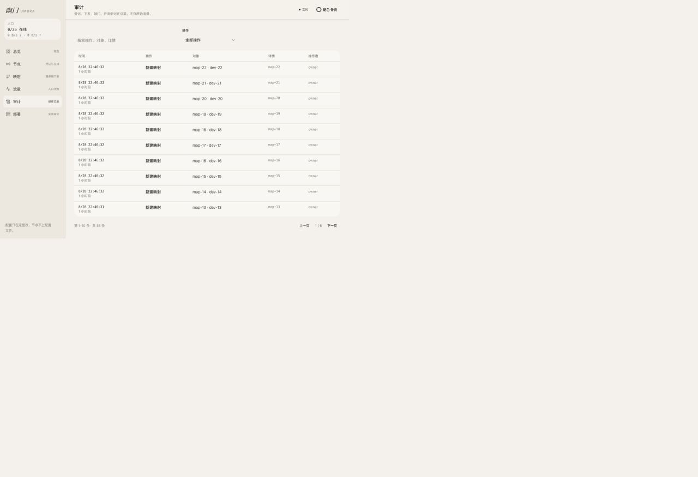

### Step 8：部署命令与复制 — 良好，需加强语义和扫读

平台、架构、入口和节点分区完整，复制后有即时提示。两个按钮都只叫“复制”，读屏用户难以区分目标；平台和架构的当前选项没有暴露选中状态。页面较长，重要安全说明集中在底部。

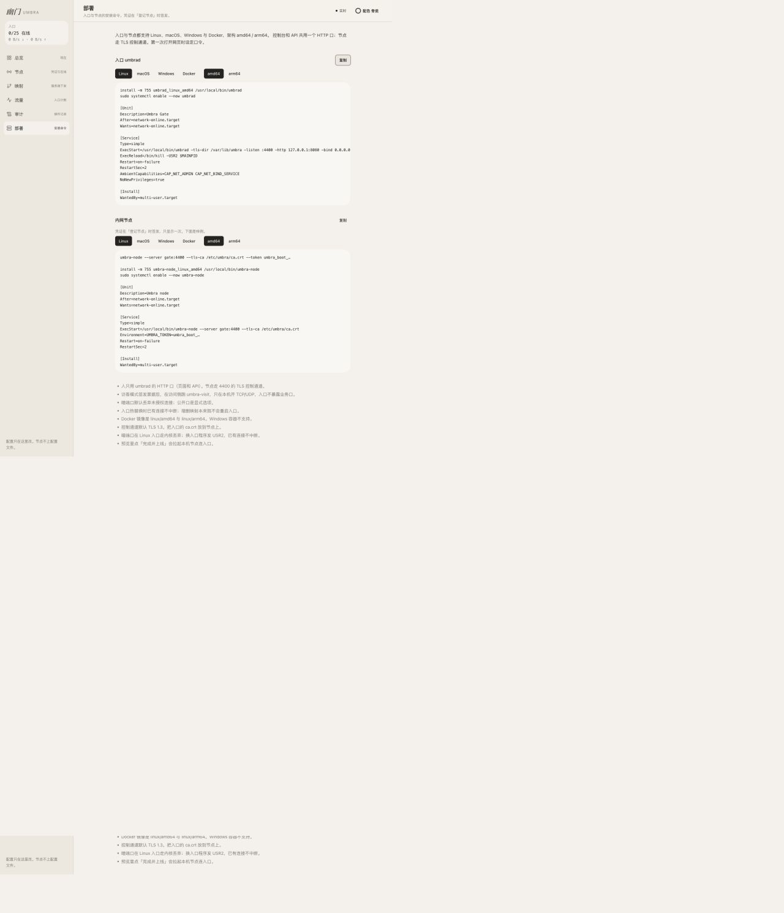

### Step 9：移动端总览 — 良好

四个指标保持两列，故障提示和核心图表仍在首屏，信息层级清晰。

### Step 10：移动端导航 — 基本良好

导航抽屉覆盖范围合适，关闭按钮自动获得焦点。对话框本身没有可访问名称，且右侧仍能看到被遮挡页面内容，状态边界不够强。

### Step 11：移动端节点卡片 — 良好

桌面表格转换为卡片，节点名称、状态、系统和映射数仍能快速扫读，没有横向溢出。

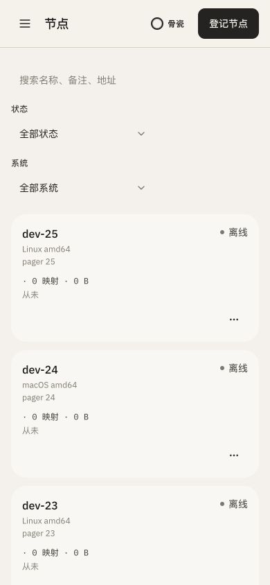

### Step 12：移动端映射卡片 — 需改进

卡片重排正确，但搜索与四个纵向筛选项占据约半个首屏，用户需要较长滚动才能进入数据区。卡片暴露 `udp_active`、`drop maxconns` 等内部英文键名，并重复离线原因。

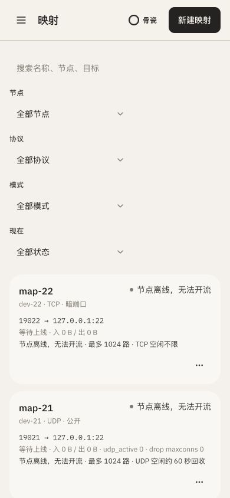

### Step 13：移动端映射表单 — 基本良好

抽屉自然切换为全屏纵向表单，输入尺寸适合触控。由于字段较多，提交按钮远离当前视口，用户容易在填写过程中失去完成进度与主动作位置。

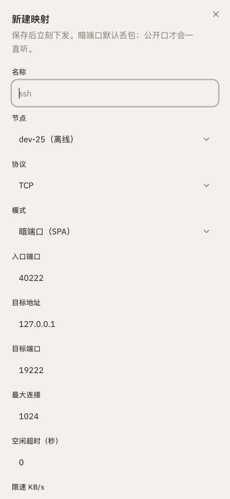

## 5. 最高优先级问题

### P1-1：小号弱文字对比度不足

默认“骨瓷”主题中，抽查到的 10–12px 辅助文字为 `rgb(138,133,124)`，背景为 `rgb(246,243,238)`，对比度约 **3.31:1**，低于普通文字常用的 WCAG AA 4.5:1 参考值。页面说明、侧栏解释和部分元信息会受影响。

**建议：** 将辅助文字色加深至至少满足 4.5:1；10px 侧栏文字同时提升到 12px，避免只靠颜色和极小字号建立次级层级。

### P1-2：下拉框与可见标签没有程序化关联

节点、映射、流量和审计页面的多个下拉框在可访问性树中只显示为无名称的 `combobox`。登记节点与新建映射抽屉也存在相同问题。

**建议：** 为每个控件使用真实 `label`/`htmlFor`，或补充唯一的 `aria-labelledby`；同时覆盖筛选器和抽屉表单。

### P1-3：重复按钮与选择状态缺少上下文

- 每行都叫“更多操作”，移动端卡片尤其无法知道它属于哪个节点或映射。
- 两个部署按钮都叫“复制”。
- 流量时间范围、部署平台和架构只有视觉选中态，没有 `aria-pressed`、`aria-selected` 或单选组语义。
- 移动端导航对话框没有名称。

**建议：** 使用“dev-25 的更多操作”“复制入口部署命令”等唯一名称；将切换器建模为单选组、标签页或带 `aria-pressed` 的按钮组；为导航抽屉增加“主导航”标题关联。

### P1-4：长表单主动作不够稳定

桌面映射抽屉在常见 720px 高视口中已经需要滚动，移动端提交按钮则远离首屏。

**建议：** 抽屉使用固定标题区与粘性底部操作栏；内容区独立滚动，并始终显示“取消 / 保存并下发”。可在按钮旁显示必填项缺失原因，而不只依赖禁用态。

## 6. 次优先级机会

1. **P2：压缩移动端筛选区。** 默认只展示搜索和一个“筛选”按钮，打开后使用底部抽屉；已选条件以可删除标签显示。
2. **P2：减少映射卡片重复信息。** 状态只出现一次，把“离线原因”放在状态行，把配额/超时放在可展开详情。
3. **P2：产品化内部指标文案。** 将 `udp_active`、`drop maxconns/ip/rate` 翻译成“UDP 活跃会话”“因连接数/IP/限速丢弃”。
4. **P2：为空状态增加下一步。** 流量空状态提供“查看离线节点”或“检查映射”按钮。
5. **P2：前置部署安全说明。** 将 TLS、凭证只显示一次、控制面 HTTP 暴露风险放到对应命令附近，而不是只集中在页面底部。

## 7. 推荐实施顺序

1. 一轮完成标签关联、唯一按钮名称、选择状态语义和移动导航命名。
2. 调整默认主题辅助文字颜色与最小字号，并对全部主题做自动对比度检查。
3. 为节点/映射抽屉增加粘性操作栏和必填提示。
4. 压缩移动端筛选器，精简映射状态与内部指标文案。
5. 补充真实在线节点、有流量、接口失败、保存失败、凭证签发完成等状态测试。

## 8. 证据限制

- 本地环境直接进入已登录控制台，没有覆盖首次设置口令、登录、超时退出和权限不足流程。
- 所有 25 台节点均离线、所有流量为 0，无法评价实时曲线、在线状态变化和高吞吐数据表现。
- 为避免改变本地配置，没有真正签发凭证或保存映射，因此成功、失败、冲突与撤销流程尚未验证。
- 键盘 Tab 顺序在当前浏览器自动化环境中未能可靠推进，不能据此断言键盘不可用；需要手工键盘与读屏器复测。
- 截图与 DOM 检查不能证明完整 WCAG 合规性，仍需 axe、VoiceOver/NVDA、200% 缩放和高对比模式测试。

## 9. 优化实施结果（2026-08-29）

本轮已按上述 P1 与主要 P2 项完成界面优化：

1. **对比度与字号：** 默认“骨瓷”主题的辅助文字色已加深，抽查对比度提升至约 4.61:1～5.02:1；侧栏 10～11px 辅助文字统一提升至 12px。
2. **表单语义：** 通用文本框、文本域、下拉框现在使用唯一 `id` 与真实 `label/htmlFor` 关联；节点、映射、流量、审计筛选器补充了可访问名称。
3. **唯一操作名称：** 节点/映射菜单包含对应条目名称，部署复制按钮区分入口与节点命令；流量范围、部署平台/架构和主题选择均暴露选中状态。
4. **稳定主动作：** 节点和映射抽屉改为固定标题、独立滚动内容、固定底部操作栏；720px 高视口中“取消 / 签发凭证”完整可见，并提供禁用原因提示。
5. **移动端效率：** 映射筛选器默认收起，可按需展开，并显示已启用条件数量与清除入口；移动导航补充“主导航”对话框标题和说明。
6. **文案与下一步：** `udp_active`、`drop maxconns/ip/rate` 已改成中文产品文案；流量空状态增加“检查映射”，部署安全提醒前置到命令区上方。

### 浏览器回归证据

桌面 1280×720：抽屉底部操作栏稳定显示，系统与架构下拉框在可访问性树中分别命名为“系统”“架构”。

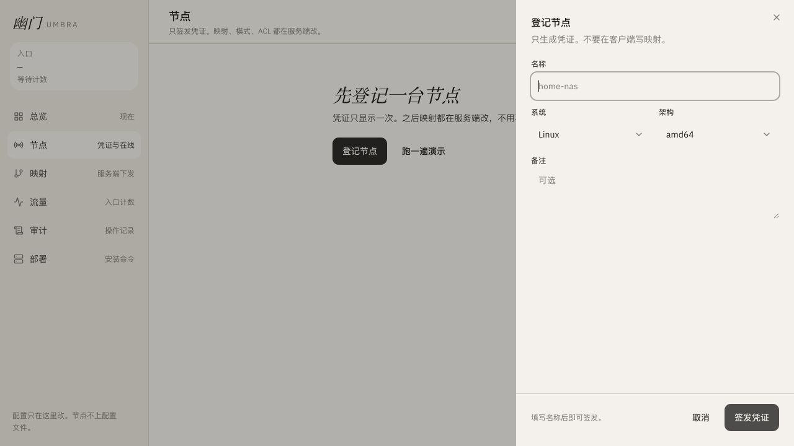

移动端 390×844：导航被识别为名称为“主导航”的对话框，关闭按钮自动获得焦点。

### 工程验证

- `npm run build:dev`：通过。
- 本轮涉及文件的定向 ESLint：通过。
- `git diff --check`：通过。
- `npm run typecheck`：仍被工作区原有的 `src/lib/umbra/actions.ts` 引用缺失模块 `./owner.server` 阻断。
- 全量测试共 195 项，177 项通过、18 项失败；失败来自工作区原有的缺失 `.grok/skills/og` 资源、迁移清单差异和环境变量测试，与本轮 UI 修改无关。
- 浏览器演示数据接口当前代理到 `127.0.0.1:4401` 时返回 502，因此本轮未重新覆盖有数据的映射列表态；相关响应式改动已通过构建、静态检查和源码复核，仍建议在管理 API 恢复后补跑一次端到端回归。
